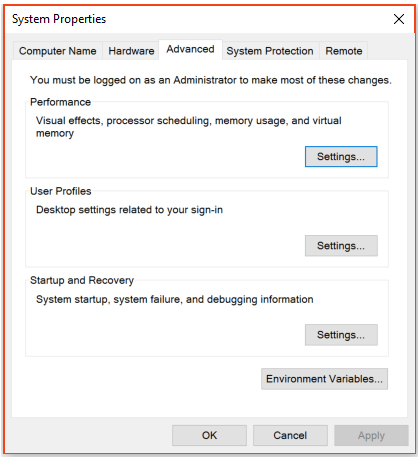

Preparing your Windows machine for Development
===================
This a useful resource to prepare Developer's  Windows laptop/PC 

Installing ATOM
-----------------------

1.	Download and install ATOM from (https://atom.io/)
2.	On the search bar type ```SystemPropertiesAdvanced```  This will open **System Properties**.

3. Go to Environment Variables >> Select “Path” and Edit>> make sure you have the path for your Atom directory. 


4.	Configure Atom:-
a.	Open Atom from the search bar, or by typing atom on the command prompt (terminal). 
b.	Open the Command Prompt (Terminal) by typing “`cmd`” in the search bar.
c.	Run the following command:
```apm install linter linter-htmlhint linter-jshint linter-scss-lint atom-beautify```


Install Git
-------------------
1.	Download Github Desktop from (https://desktop.github.com/) and install it.
2.	Go to the Terminal and type the following: 
	`git config --global user.name "<FIRST_NAME> <LAST_NAME>"`
	`git config --global user.email <you@example.com>`
	`git config --global credential.helper osxkeychain`
	`git config --global push.default matching`
	`git config --global core.editor "atom --wait"`

3.	confirm that this worked by typing “git config –list” into the terminal. The same settings should be echoed back to you.
4.	Go to Start menu under you will find “Git-Hub” >> “Git-Shell” pin that to your start menu or task-bar. As this will be your terminal.

Install Node.js® and NPM 
----------------------------------
1.	Download the Windows installer from (https://nodejs.org/en/).
2.	Run the installer (the .msi file you downloaded in the previous step.)
3.	Follow the prompts in the installer (Accept the license agreement, click the NEXT button a bunch of times and accept the default installation settings).


4.	Restart your computer. You won’t be able to run Node.js® until you restart your computer.
5.	Test Node. To see if Node is installed, open the Windows Command Prompt, Powershell or a similar command line tool, and type `node -v`. This should print a version number, so you’ll see something like this v0.10.35.
6.	Make sure you have npm directory in your path 
a.	Got to System Properties >> Enviroment Variables >> Path 
b.	Add the npm directory path should look like (C:\Users\hammo\AppData\Roaming\npm)
Windows Environment setup and configuration 
1.	Install all the required tools and configurations using Microsoft's windows-build-tools by running “`npm install -g windows-build-tools`” from an elevated PowerShell (run as Administrator).
2.	Install OpenSSL from https://slproweb.com/products/Win32OpenSSL.html add C:\OpenSSL-Win64\bin (make sure of the right path before adding it to Enviroment Variables >> Path)

Install Ruby for windows
----------------------------------
1.	Download and run installation from (http://rubyinstaller.org/downloads/) remember to pick x64 if you are using a 64-bit windows. 
 
2.	Make sure to select “Add Ruby executables to PATH” and “Associate .rb and .rbw files with this Ruby installation.”

Install Hub
-----------------
Download hub 2.3.0 from (https://github.com/github/hub/releases/download/v2.3.0-pre3/hub-windows-amd64-2.3.0-pre3.zip).
decompress the file into a folder (right click and you will find an option).
Open the folder and run the and run the `install.bat` “as Administrator”.
You can refer to the following repo for more information (https://github.com/github/hub/releases)
Install Surge
-----------------
enter the following command into the terminal: `npm install --global surge`
confirm installation by typing `surge --version` into the terminal
Install Sass
----------------
enter the following command into the terminal: `gem install sass`
confirm installation by typing `sass -v` into the terminal

Install Redis
----------------
Install Redis from (https://github.com/downloads/rgl/redis/redis-2.4.6-setup-64-bit.exe) it runs as a service on windows. to check if the service is running you can run the command `net start` that will return a list of running services on your machine.
For other versions you can visit (https://github.com/rgl/redis/downloads). 

Install PostgreSQL
--------------------------
1.	Download and run installation from (http://www.enterprisedb.com/postgresql-960-beta-installers-win64-1?ls=Crossover&type=Crossover) this is a x64 version for other versions you can go to (http://www.enterprisedb.com/products-services-training/pgdownload#windows).  
2.	From the command line run “`psql -U postgres`” this will get you in to psql mode.
3.	Use the command “`create user <youruser>`” preferred that the user is your windows user. 
4.	This command will allow the user to add and delete Databases “`ALTER USER <youruser> CREATEDB`”
5.	To exit type “`\q`”


